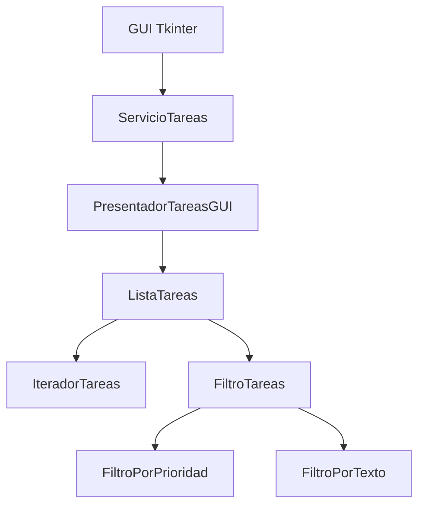
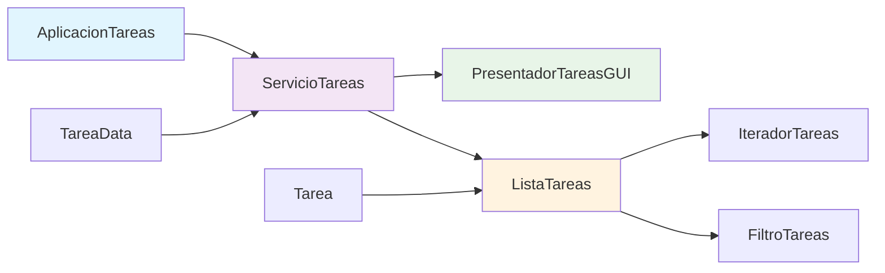
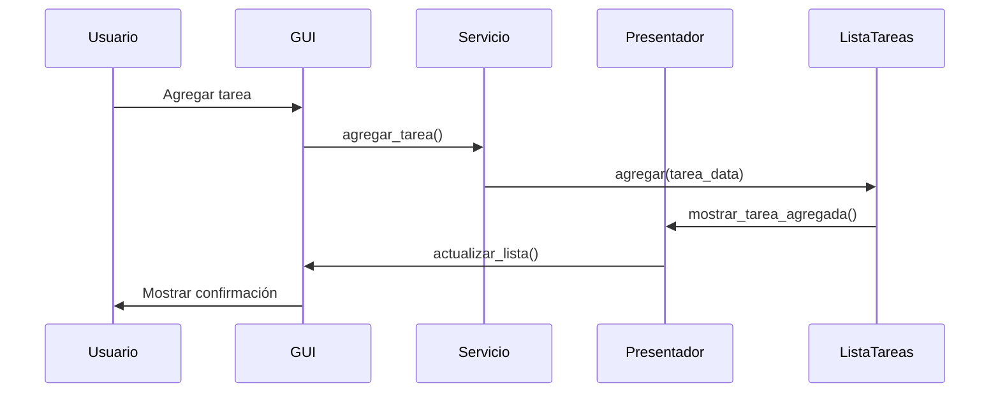

# 🚀 Gestor de Tareas - Aplicación SOLID con GUI


> **Sistema de gestión de tareas implementando principios SOLID con interfaz gráfica moderna y arquitectura escalable**

---

## 🌟 **Características Principales**

### 🏗️ **Arquitectura SOLID**
- ✅ **SRP**: Separación clara de responsabilidades entre clases
- ✅ **OCP**: Extensible mediante abstracciones y patrones
- ✅ **LSP**: Sustituibilidad de tipos base y derivados
- ✅ **ISP**: Interfaces específicas y cohesivas
- ✅ **DIP**: Inversión de dependencias con inyección

### 🎨 **Interfaz de Usuario Avanzada**
- 🖼️ **GUI moderna** con Tkinter y ttk widgets
- 🎯 **Sistema de prioridades** con colores visuales
- 🔍 **Búsqueda y filtrado** en tiempo real
- 📊 **Estadísticas integradas** y reporting
- 🎨 **Tema personalizado** con estilos mejorados

### 🔧 **Patrones de Diseño Implementados**


---

## 📁 **Estructura del Proyecto**

```
gestor-tareas-solid/
├── main.py                    # 🚀 Punto de entrada de la aplicación
├── requirements.txt           # 📦 Dependencias del proyecto
├── docs/                     # 📚 Documentación
│   └── ARCHITECTURE.md       # 🏗️ Documentación técnica
└── README.md                 # 📖 Este archivo
```

---

## 🛠️ **Tecnologías y Patrones**

### 🔧 **Framework y GUI**
- **Python 3.8+** - Lenguaje principal
- **Tkinter/ttk** - Interfaz gráfica nativa
- **Dataclasses** - Estructuras de datos inmutables
- **ABC** - Clases abstractas para contratos

### 🏗️ **Patrones de Diseño**
- **Strategy Pattern** - Filtros intercambiables
- **Iterator Pattern** - Recorrido de colecciones
- **Presenter Pattern** - Separación vista-lógica
- **DAO Pattern** - Acceso a datos abstracto
- **DTO Pattern** - Transferencia de datos

### 🎯 **Principios SOLID**
- **Single Responsibility** - Cada clase una responsabilidad
- **Open/Closed** - Extensible sin modificar
- **Liskov Substitution** - Sustituibilidad garantizada
- **Interface Segregation** - Interfaces específicas
- **Dependency Inversion** - Dependencias en abstracciones

---

## 🚀 **Instalación y Ejecución**

### Prerrequisitos
```bash
# Python 3.8 o superior
python --version

# Tkinter (generalmente incluido en Python)
python -m tkinter
```
### 📦 **Dependencias**
```txt
# El proyecto utiliza solo librerías estándar de Python
# No se requieren instalaciones adicionales
```

---

## 🏗️ **Arquitectura del Sistema**

### 🔄 **Diagrama de Componentes**


### 📊 **Flujo de Datos**


---

## 🎨 **Características de la Interfaz**

### ✨ **Componentes Principales**
- **🆕 Panel de Nueva Tarea**: Entrada con validación y selección de prioridad
- **🔍 Panel de Búsqueda**: Filtrado en tiempo real por texto y prioridad
- **📋 Lista de Tareas**: Visualización con colores por prioridad
- **📊 Panel de Estadísticas**: Reporte de distribución de tareas
- **📝 Barra de Estado**: Feedback continuo de operaciones

### 🎯 **Sistema de Prioridades**
| Prioridad | Color | Significado |
|-----------|-------|-------------|
| **1 - Alta** | 🟥 Rojo | Crítico/Urgente |
| **2 - Media** | 🟨 Amarillo | Importante |
| **3 - Baja** | 🟩 Verde | Opcional |

### 🔧 **Funcionalidades de UI**
```python
# Código de ejemplo - Configuración de estilos
style.configure("alta.Treeview", background='#ffebee')
style.configure("media.Treeview", background='#fff3e0') 
style.configure("baja.Treeview", background='#e8f5e8')
```

---

## 🔧 **API del Servicio de Tareas**

### 📝 **Operaciones Principales**
```python
class ServicioTareas:
    def agregar_tarea(self, descripcion: str, prioridad: int) -> bool
    def eliminar_tarea(self, descripcion: str) -> bool
    def buscar_tarea(self, descripcion: str) -> None
    def filtrar_tareas_por_prioridad(self, prioridad: int) -> None
    def filtrar_tareas_por_texto(self, texto: str) -> None
    def mostrar_todas_tareas(self) -> None
    def obtener_estadisticas(self) -> dict
```

### 🎯 **Ejemplos de Uso**
```python
# Agregar tarea de alta prioridad
servicio.agregar_tarea("Revisar informe final", 1)

# Filtrar tareas de prioridad media
servicio.filtrar_tareas_por_prioridad(2)

# Obtener estadísticas
stats = servicio.obtener_estadisticas()
print(f"Total tareas: {stats['total']}")
```

---

## 🏗️ **Implementación de SOLID**

### ✅ **Single Responsibility Principle**
```python
# Cada clase tiene una única responsabilidad
class ListaTareas:          # Gestión de colección
class PresentadorTareas:    # Presentación de datos  
class ServicioTareas:       # Lógica de negocio
class FiltroTareas:         # Filtrado de elementos
```

### ✅ **Open/Closed Principle**
```python
# Extensible sin modificar código existente
class FiltroTareas(ABC):
    @abstractmethod
    def filtrar(self, tarea: Tarea) -> bool

class FiltroPorFecha(FiltroTareas):  # Nueva funcionalidad
    def filtrar(self, tarea: Tarea) -> bool:
        # Implementación específica
```

### ✅ **Liskov Substitution Principle**
```python
# Todas las implementaciones son sustituibles
filtros = [
    FiltroPorPrioridad(1),
    FiltroPorTexto("urgente"),
    FiltroPorFecha(datetime.now())
]

for filtro in filtros:
    resultados = lista.aplicar_filtro(filtro)  # Funciona igual para todos
```

### ✅ **Interface Segregation Principle**
```python
# Interfaces específicas y cohesivas
class OperacionesLista(ABC):        # Solo operaciones CRUD
class PresentadorTareas(ABC):       # Solo presentación
class FiltroTareas(ABC):            # Solo filtrado
```

### ✅ **Dependency Inversion Principle**
```python
# Depende de abstracciones, no de implementaciones
class ServicioTareas:
    def __init__(self, lista_tareas: OperacionesLista,  # Abstracción
                 presentador: PresentadorTareas):        # Abstracción
        self.lista_tareas = lista_tareas
        self.presentador = presentador
```

---

## 🔍 **Patrones de Diseño Detallados**

### 🔄 **Iterator Pattern**
```python
class IteradorTareas:
    def __init__(self, cabeza: Optional[Tarea]):
        self.actual = cabeza

    def __next__(self) -> Tarea:
        if not self.actual:
            raise StopIteration
        tarea = self.actual
        self.actual = self.actual.siguiente
        return tarea
```

### 🎯 **Strategy Pattern**
```python
class FiltroTareas(ABC):
    @abstractmethod
    def filtrar(self, tarea: Tarea) -> bool

class FiltroPorPrioridad(FiltroTareas):
    def filtrar(self, tarea: Tarea) -> bool:
        return tarea.prioridad == self.prioridad
```

### 📊 **Presenter Pattern**
```python
class PresentadorTareas(ABC):
    @abstractmethod
    def mostrar_tarea_agregada(self, tarea: Tarea) -> None
    @abstractmethod 
    def actualizar_lista_tareas(self, tareas: list[Tarea]) -> None
```

---

## 🚀 **Características Avanzadas**

### 🔍 **Búsqueda y Filtrado**
- **Búsqueda en tiempo real** mientras se escribe
- **Filtrado por prioridad** con selector desplegable
- **Combinación de filtros** para búsquedas complejas
- **Restablecimiento fácil** a vista completa

### 💾 **Gestión de Estado**
```python
# Dataclass para transferencia inmutable
@dataclass
class TareaData:
    descripcion: str
    prioridad: int

# Estadísticas en tiempo real
def obtener_estadisticas(self) -> dict:
    return {
        "total": self.lista_tareas.contar(),
        "prioridades": {1: 5, 2: 3, 3: 2}  # Datos reales
    }
```

### 🎨 **Experiencia de Usuario**
- **Feedback visual inmediato** para todas las acciones
- **Mensajes de estado descriptivos** en barra inferior
- **Confirmaciones de eliminación** implícitas
- **Focus management** inteligente entre campos

---

## 📈 **Extensibilidad del Sistema**

### 🔧 **Agregar Nuevos Filtros**
```python
class FiltroPorFecha(FiltroTareas):
    def __init__(self, fecha_limite: datetime):
        self.fecha_limite = fecha_limite
    
    def filtrar(self, tarea: Tarea) -> bool:
        return tarea.fecha_creacion <= self.fecha_limite

# Uso inmediato sin modificar código existente
filtro_fecha = FiltroPorFecha(datetime.now())
tareas_filtradas = lista_tareas.aplicar_filtro(filtro_fecha)
```

### 🎯 **Nuevos Presentadores**
```python
class PresentadorTareasConsola(PresentadorTareas):
    def mostrar_tarea_agregada(self, tarea: Tarea) -> None:
        print(f"✅ Tarea agregada: {tarea}")
    
    def actualizar_lista_tareas(self, tareas: list[Tarea]) -> None:
        for tarea in tareas:
            print(f" - {tarea}")
```

---

## 🤝 **Contribución al Proyecto**

### 🛠️ **Guía de Desarrollo**
1. **Sigue los principios SOLID** en nuevas funcionalidades
2. **Mantén la separación de concerns** 
3. **Usa tipos hints** para mejor mantenibilidad
4. **Preserva la compatibilidad** de interfaces existentes

### 📝 **Estructura de Commits**
```
feat: agregar nuevo filtro por fecha
refactor: mejorar presentador GUI  
fix: corregir eliminación de tareas
docs: actualizar documentación SOLID
```

---

## 📄 **Licencia**

Este proyecto está bajo la Licencia MIT. Consulta el archivo [LICENSE](LICENSE) para más detalles.

---

<div align="center">

### ⭐ **¿Te gusta la arquitectura SOLID?**
¡Dale una estrella al proyecto y comparte tus mejoras!

**Desarrollado con ❤️ por [Astharmin](https://github.com/Astharmin)**

---
</div>
