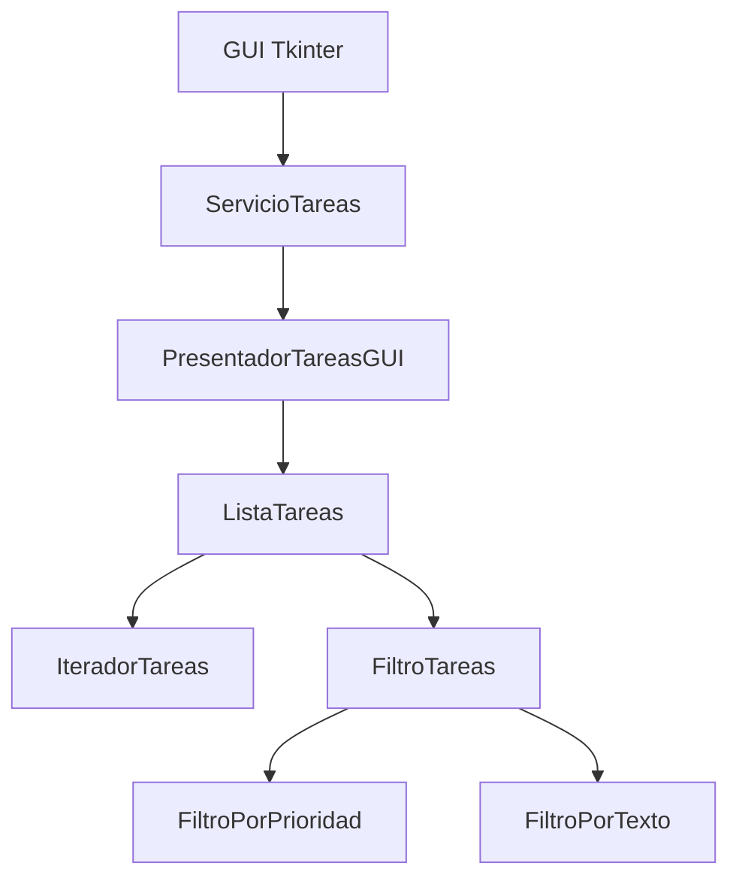
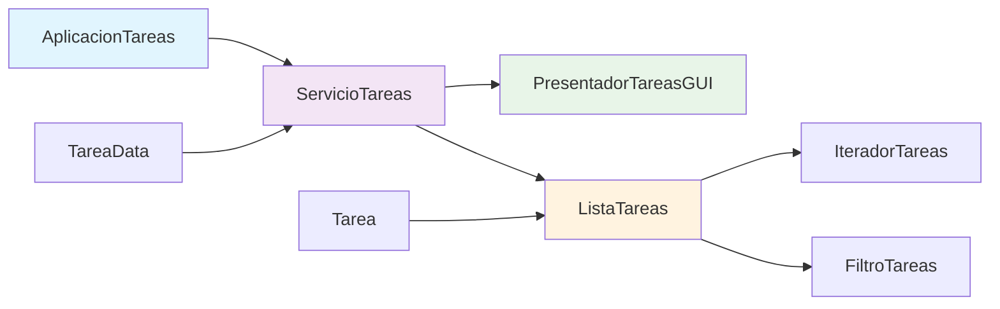
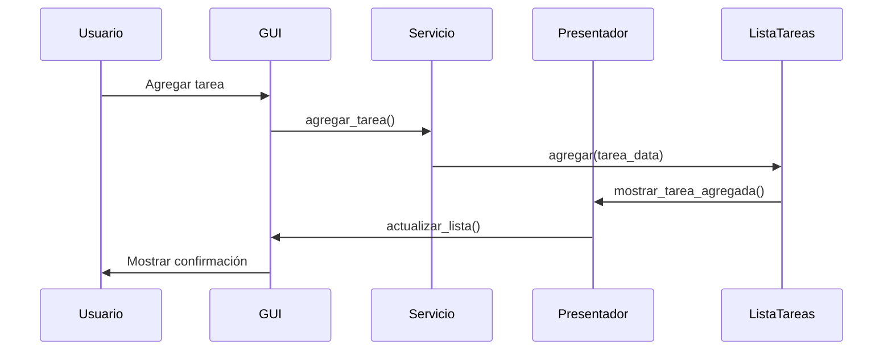

# 🚀 Gestor de Tareas - Aplicación SOLID con GUI


> **Sistema de gestión de tareas implementando principios SOLID con interfaz gráfica moderna y arquitectura escalable - Listo para usar en Windows**

---

## 🌟 **Características Principales**

### 🏗️ **Arquitectura SOLID**
- ✅ **SRP**: Separación clara de responsabilidades entre clases
- ✅ **OCP**: Extensible mediante abstracciones y patrones
- ✅ **LSP**: Sustituibilidad de tipos base y derivados
- ✅ **ISP**: Interfaces específicas y cohesivas
- ✅ **DIP**: Inversión de dependencias con inyección

### 🎨 **Interfaz de Usuario Avanzada**
- 🖼️ **GUI moderna** con Tkinter y ttk widgets
- 🎯 **Sistema de prioridades** con colores visuales
- 🔍 **Búsqueda y filtrado** en tiempo real
- 📊 **Estadísticas integradas** y reporting
- 🎨 **Tema personalizado** con estilos mejorados

### 🔧 **Patrones de Diseño Implementados**


---

## 📥 **Descarga e Instalación**

### ⚡ **Instalación Instantánea para Windows**

**Descarga directa del ejecutable:**
[⬇️ Descargar GestorTareas.exe](https://github.com/Astharmin/gestor-tareas-solid/releases/latest/download/GestorTareas.exe)

### 🚀 **Cómo Usar**
1. **Descarga** el archivo `GestorTareas.exe`
2. **Ejecuta** directamente (no requiere instalación)
3. **¡Listo!** La aplicación se abrirá inmediatamente

### 🔒 **Características del Ejecutable**
- ✅ **Portable** - No requiere instalación
- ✅ **Autónomo** - Incluye todo lo necesario
- ✅ **Seguro** - Sin dependencias externas
- ✅ **Ligero** - Tamaño optimizado
- ✅ **Compatible** - Windows 10/11

---

## 📁 **Estructura del Proyecto**

```
gestor-tareas-solid/
├── GestorTareas.exe          # 🚀 Ejecutable principal (Windows)
├── main.py                   # 📝 Código fuente Python
├── requirements.txt          # 📦 Dependencias del proyecto
├── docs/                    # 📚 Documentación
│   └── ARCHITECTURE.md      # 🏗️ Documentación técnica
└── README.md                # 📖 Este archivo
```

---

## 🛠️ **Tecnologías y Patrones**

### 🔧 **Framework y GUI**
- **Python 3.8+** - Lenguaje principal
- **Tkinter/ttk** - Interfaz gráfica nativa
- **Dataclasses** - Estructuras de datos inmutables
- **ABC** - Clases abstractas para contratos

### 🏗️ **Patrones de Diseño**
- **Strategy Pattern** - Filtros intercambiables
- **Iterator Pattern** - Recorrido de colecciones
- **Presenter Pattern** - Separación vista-lógica
- **DAO Pattern** - Acceso a datos abstracto
- **DTO Pattern** - Transferencia de datos

### 🎯 **Principios SOLID**
- **Single Responsibility** - Cada clase una responsabilidad
- **Open/Closed** - Extensible sin modificar
- **Liskov Substitution** - Sustituibilidad garantizada
- **Interface Segregation** - Interfaces específicas
- **Dependency Inversion** - Dependencias en abstracciones

---

## 🏗️ **Arquitectura del Sistema**

### 🔄 **Diagrama de Componentes**


### 📊 **Flujo de Datos**


---

## 🎨 **Características de la Interfaz**

### ✨ **Componentes Principales**
- **🆕 Panel de Nueva Tarea**: Entrada con validación y selección de prioridad
- **🔍 Panel de Búsqueda**: Filtrado en tiempo real por texto y prioridad
- **📋 Lista de Tareas**: Visualización con colores por prioridad
- **📊 Panel de Estadísticas**: Reporte de distribución de tareas
- **📝 Barra de Estado**: Feedback continuo de operaciones

### 🎯 **Sistema de Prioridades**
| Prioridad | Color | Significado |
|-----------|-------|-------------|
| **1 - Alta** | 🟥 Rojo | Crítico/Urgente |
| **2 - Media** | 🟨 Amarillo | Importante |
| **3 - Baja** | 🟩 Verde | Opcional |

---

## 🔧 **Uso Rápido**

### 🎯 **Primeros Pasos**
1. **Descargar** el ejecutable desde el link anterior
2. **Ejecutar** `GestorTareas.exe`
3. **Agregar tareas** usando el panel superior
4. **Organizar** por prioridades (Alta, Media, Baja)
5. **Buscar y filtrar** según necesidades

### ⚡ **Funcionalidades Clave**
- **Agregar tarea**: Escribe descripción + selecciona prioridad
- **Eliminar tarea**: Selecciona y click en "Eliminar Seleccionada"
- **Buscar**: Escribe en el campo de búsqueda (filtrado automático)
- **Filtrar por prioridad**: Usa el selector desplegable
- **Ver estadísticas**: Click en "Estadísticas" para resumen

---

## 🔧 **Para Desarrolladores**

### 📦 **Ejecución desde Código Fuente**
```bash
# Solo si quieres modificar el código
git clone https://github.com/Astharmin/gestor-tareas-solid.git
cd gestor-tareas-solid
python main.py
```

### 🛠️ **Requisitos para Desarrollo**
- Python 3.8 o superior
- Tkinter (incluido en Python estándar)
- No se requieren dependencias adicionales

---

## 🏗️ **Implementación de SOLID**

### ✅ **Single Responsibility Principle**
```python
# Cada clase tiene una única responsabilidad
class ListaTareas:          # Gestión de colección
class PresentadorTareas:    # Presentación de datos  
class ServicioTareas:       # Lógica de negocio
class FiltroTareas:         # Filtrado de elementos
```

### ✅ **Open/Closed Principle**
```python
# Extensible sin modificar código existente
class FiltroTareas(ABC):
    @abstractmethod
    def filtrar(self, tarea: Tarea) -> bool

class FiltroPorFecha(FiltroTareas):  # Nueva funcionalidad
    def filtrar(self, tarea: Tarea) -> bool:
        # Implementación específica
```

---

## 🔍 **Patrones de Diseño Detallados**

### 🔄 **Iterator Pattern**
```python
class IteradorTareas:
    def __init__(self, cabeza: Optional[Tarea]):
        self.actual = cabeza

    def __next__(self) -> Tarea:
        if not self.actual:
            raise StopIteration
        tarea = self.actual
        self.actual = self.actual.siguiente
        return tarea
```

### 🎯 **Strategy Pattern**
```python
class FiltroTareas(ABC):
    @abstractmethod
    def filtrar(self, tarea: Tarea) -> bool

class FiltroPorPrioridad(FiltroTareas):
    def filtrar(self, tarea: Tarea) -> bool:
        return tarea.prioridad == self.prioridad
```

---

## 🚀 **Características Avanzadas**

### 🔍 **Búsqueda y Filtrado**
- **Búsqueda en tiempo real** mientras se escribe
- **Filtrado por prioridad** con selector desplegable
- **Combinación de filtros** para búsquedas complejas
- **Restablecimiento fácil** a vista completa

### 💾 **Gestión de Estado**
```python
# Dataclass para transferencia inmutable
@dataclass
class TareaData:
    descripcion: str
    prioridad: int
```

---

## 📈 **Extensibilidad del Sistema**

### 🔧 **Agregar Nuevos Filtros**
```python
class FiltroPorFecha(FiltroTareas):
    def __init__(self, fecha_limite: datetime):
        self.fecha_limite = fecha_limite
    
    def filtrar(self, tarea: Tarea) -> bool:
        return tarea.fecha_creacion <= self.fecha_limite
```

## 📄 **Licencia**

Este proyecto está bajo la Licencia MIT. Consulta el archivo [LICENSE](LICENSE) para más detalles.

---

<div align="center">

### ⚡ **¡Descarga y Usa Ahora!**
[⬇️ Descargar GestorTareas.exe](https://github.com/Astharmin/gestor-tareas-solid/releases/latest/download/GestorTareas.exe)

### ⭐ **¿Te gusta la arquitectura SOLID?**
¡Dale una estrella al proyecto y comparte tus mejoras!

**Desarrollado con ❤️ por [Astharmin](https://github.com/Astharmin)**

---
</div>
